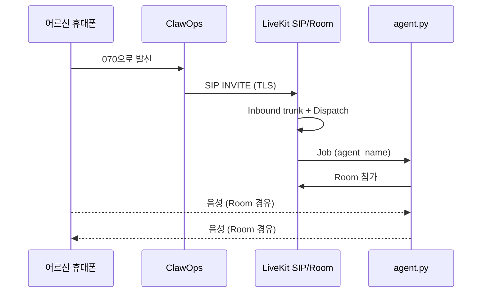
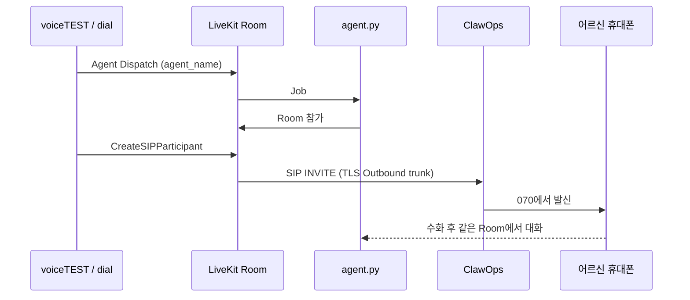

# Mode 05 · ClawOps + LiveKit 전화 연동 가이드

전화 레이어만 ClawOps, 상담 AI는 LiveKit Room의 Agent 워커(지금은 로컬 `agent.py`)가 담당한다.  
이 문서는 **실제로 검증된 구조**와 콘솔 설정 순서를 정리한다.

관련 문서: [LIVEKIT_CLAWOPS_SETUP.md](./LIVEKIT_CLAWOPS_SETUP.md), [livekit-clawops-session.md](./livekit-clawops-session.md)

---

## 1. 전체 구조 개념

### 1.1 한 줄 요약

**전화망(PSTN) ↔ ClawOps SIP 트렁크 ↔ LiveKit SIP ↔ LiveKit Room ↔ Agent 워커(STT-LLM-TTS / OpenAI Realtime)**

앱(voiceTEST Mode 05)은 룸·발신·체크리스트를 돕고, **대화 엔진은 Room 안의 Agent**다.

### 1.2 등장 인물

| 이름 | 역할 |
|------|------|
| **070 번호** | 사람이 걸고/받는 일반 전화 번호 (예: `07052767794`) |
| **SIP 트렁크** | 일반 전화망과 SIP(인터넷 전화)를 잇는 ClawOps 회선 |
| **SIP 엔드포인트 + 라우트** | 인바운드 시 070을 LiveKit SIP URI로 넘기는 ClawOps 설정 |
| **LiveKit Inbound trunk** | ClawOps에서 들어온 INVITE를 받을 LiveKit 쪽 입구 |
| **LiveKit Outbound trunk** | LiveKit이 ClawOps로 걸어 나갈 때 쓰는 출구 (TLS + digest) |
| **Dispatch rule** | 인바운드 통화를 어느 Room / 어느 Agent에 붙일지 |
| **Agent Dispatch** | 아웃바운드 시 앱이 Agent를 Room에 붙이는 API |
| **Agent 워커** | 로컬 `agent.py` (또는 추후 자체 상담 AI). `agent_name`으로 등록 |
| **LiveKit Room** | AI와 전화 참가자가 만나는 자리 |

### 1.3 헷갈리기 쉬운 것

| 메뉴 / 개념 | 쓰는 곳 | Mode 05 |
|-------------|---------|---------|
| SIP 인증정보 / **SIP 단말** | Softphone(Linphone 등) | ❌ 쓰지 않음 |
| **SIP 엔드포인트 + SIP 라우트** | 070 → 외부 URI(LiveKit) | ✅ 인바운드 |
| ClawOps 매니지드 Voice Agent | ClawOps 안에서 AI | ❌ (Mode 04 데모용) |
| 통화상태 webhook (`statusCallback`) | 상태 통지 | 선택 (미디어와 무관) |

### 1.4 인바운드 흐름

```text
어르신 휴대폰
    │  070-xxxx 로 전화
    ▼
ClawOps (전화망 + SIP 트렁크)
    │  인바운드 라우팅 = SIP
    │  엔드포인트 → LiveKit URI (TLS :5061)
    ▼
LiveKit Cloud SIP (Inbound trunk)
    │  numbers / allowed_addresses 매칭
    ▼
LiveKit Room (예: call-…)
    │  Dispatch rule → agent_name
    ▼
로컬 agent.py 워커  ←── 같은 Room에서 대화
```



### 1.5 아웃바운드 흐름

```text
voiceTEST Mode 05 / dial.py
    │  1) Agent Dispatch → Room
    │  2) CreateSIPParticipant
    ▼
LiveKit Room + agent.py
    │
    ▼
LiveKit Outbound trunk (TLS)
    │  address = *.sip.claw-ops.com
    ▼
ClawOps SIP → 전화망
    │
    ▼
어르신 휴대폰 벨 → 받으면 같은 Room에서 agent.py와 대화
```



핵심: **인바운드·아웃바운드 모두 “같은 LiveKit Room에서 로컬 agent.py와 만난다.”**  
차이는 INVITE 방향(ClawOps→LiveKit vs LiveKit→ClawOps)뿐이다.

---

## 2. 사전 준비

1. ClawOps **Business(또는 유료) + SIP 트렁크 부가** 활성
2. LiveKit Cloud 프로젝트 (URL / API Key / Secret / SIP URI)
3. 로컬 Agent 워커 폴더 (예: `livekit-phone-test/agent.py`)
4. voiceTEST 레포 + Mode 05 (outbound는 Agent Dispatch 포함 버전 권장, PR #4)

참고 번호(예시): `07052767794`  
ClawOps 시그널링 IP(Inbound allowlist용): `34.47.65.45`  
RTP 참고: `34.64.155.183`

---

## 3. ClawOps 설정 (차근차근)

### 3.1 공통

1. 대시보드 로그인
2. SIP 트렁크 부가서비스 켜기
3. 070 번호 확인 (`CLAWOPS_FROM_NUMBER=07052767794` 형태로 env에 저장, 하이픈 없이)

### 3.2 인바운드용 — 엔드포인트 + 라우트 + 번호 라우팅

**목표:** 070로 온 전화를 LiveKit SIP로 넘긴다.

#### Step A. SIP 엔드포인트

1. **SIP 엔드포인트**(또는 SIP 트렁크) 메뉴로 이동  
   - ❌ `SIP 인증정보 > SIP 단말` 아님
2. 엔드포인트 생성 · **활성**
3. 라우트(도착지)에 LiveKit URI 등록  
   - 예: `sip:<서브도메인>.sip.livekit.cloud:5061`  
   - transport: **TLS**
4. 옵션 (검증된 기본값)  
   - **외부 SIP 인증 사용:** 미체크 (LiveKit는 IP allowlist)  
   - **User(선택):** 비움 → 수신 070 자동 주입

#### Step B. SIP 라우트 ≥ 1개 · 활성

문서 기준: `routingType=sip` 쓰려면 **활성 엔드포인트 + 활성 라우트 1개 이상** 필수.  
없으면 내번호 인바운드에서 SIP가 안 열리거나 실패한다.

#### Step C. 내번호 → 인바운드 라우팅

1. 해당 070 선택
2. 착신: **SIP** (webhook / agent / softphone 아님)
3. 엔드포인트: 위에서 만든 것 선택
4. **통화상태 webhook:** 비워도 됨 (선택)

주의: Mode 04(ClawOps Agent)와 **같은 070 하나**면 라우팅이 충돌한다. Mode 05 테스트 때는 SIP로 둔다.

### 3.3 아웃바운드용 — LiveKit가 걸어 나갈 SIP (별도)

인바운드 “엔드포인트→LiveKit”와 **방향이 반대**다. ClawOps에서 LiveKit이 붙을 **Outbound SIP 도메인 + digest**를 만든다.

검증된 예:

| 항목 | 값 |
|------|-----|
| domain | `ac6gqm4tmcj5sr867e.sip.claw-ops.com` |
| port | `5061` |
| transport | `TLS` |
| auth | username / password (digest) |

이 값은 LiveKit **Outbound trunk**의 `address` / `authUsername` / `authPassword`에 넣는다.  
(아래 LiveKit 절 참고)

---

## 4. LiveKit Cloud 설정 (차근차근)

### 4.1 프로젝트 정보 확보

- `LIVEKIT_URL` = `wss://….livekit.cloud`
- API Key / Secret
- SIP URI = `sip:<서브도메인>.sip.livekit.cloud` (ClawOps 엔드포인트에 넣은 것과 동일)

### 4.2 인바운드 — Inbound trunk

1. **Telephony → SIP trunks → Create → Inbound**
2. JSON 예:

```json
{
  "name": "clawops-070",
  "numbers": ["07052767794"],
  "allowedAddresses": ["34.47.65.45"],
  "krispEnabled": true
}
```

3. **번호 형식은 ClawOps Request-URI와 완전 일치**  
   - 먼저 `07052767794`  
   - 안 되면 `+827052767794`  
   - ❌ `+07052767794` 금지
4. digest username/password는 넣지 않음 (IP allowlist)
5. trunk ID → `LIVEKIT_INBOUND_TRUNK_ID`

`allowedAddresses`가 거절되면 프로젝트에서 IP allowlist enable이 필요할 수 있다.

### 4.3 인바운드 — Dispatch rule

1. **Telephony → Dispatch rules → Create**
2. JSON 예 (`agentName` = 워커와 동일):

```json
{
  "name": "clawops-inbound-to-agent",
  "rule": {
    "dispatchRuleIndividual": {
      "roomPrefix": "call-"
    }
  },
  "roomConfig": {
    "agents": [
      {
        "agentName": "phone-test-openai"
      }
    ]
  }
}
```

통화마다 `call-…` 룸을 만들고, 지정 Agent를 붙인다.

### 4.4 아웃바운드 — Outbound trunk

1. **Telephony → SIP trunks → Create → Outbound**
2. `address`에는 **호스트만** (sip: / :5061 넣지 않음)

```json
{
  "name": "clawops-outbound",
  "address": "ac6gqm4tmcj5sr867e.sip.claw-ops.com",
  "numbers": ["07052767794"],
  "authUsername": "<ClawOps digest user>",
  "authPassword": "<ClawOps digest password>"
}
```

3. **Transport는 반드시 TLS**  
   - 콘솔 JSON에 `"transport": "SIP_TRANSPORT_TLS"` 넣으면 생성 실패할 수 있음  
   - transport 없이 만든 뒤 **UI에서 TLS로 변경**, 또는 `"transport": "TLS"` 시도  
   - 콜 상세에서 **Signaling Connection Type = TLS** 인지 확인  
   - UDP면 `sip request timed out` 나기 쉬움
4. trunk ID → `LIVEKIT_OUTBOUND_TRUNK_ID`

### 4.5 번호 형식 (아웃바운드 실패 단골)

| 잘못된 값 | 올바른 값 |
|-----------|-----------|
| `+07052767794` | `07052767794` 또는 `+827052767794` |
| `+01099165035` | `01099165035` 또는 `+821099165035` |

---

## 5. 로컬 Agent 워커

상담 AI는 Room의 Agent다. voiceTEST 앱이 워커를 대신 띄우지 않는다.

```bash
cd /path/to/livekit-phone-test
source .venv/bin/activate
python agent.py dev
```

- `@server.rtc_session(agent_name="phone-test-openai")`  
- Dispatch / `LIVEKIT_AGENT_NAME`과 **글자 하나까지 동일**
- `.env.local`: `LIVEKIT_URL`, `LIVEKIT_API_KEY`, `LIVEKIT_API_SECRET`, `OPENAI_API_KEY`  
  (아웃바운드를 워커가 직접 걸 때) `LIVEKIT_OUTBOUND_TRUNK_ID`, `CLAWOPS_FROM_NUMBER`

인바운드: metadata 없이 Job → SIP 참가자 대기 → 대화  
아웃바운드(dial.py 방식): metadata `{"phone_number":"010…"}` → 워커가 CreateSIPParticipant  
아웃바운드(Mode 05 앱 방식): 앱이 Agent Dispatch(빈 metadata) + CreateSIPParticipant → 워커는 인바운드처럼 참가자 대기

---

## 6. voiceTEST Mode 05

### 6.1 서버

```bash
cd /path/to/voiceTEST
source .venv/bin/activate
pip install -r requirements-livekit.txt   # 최초 1회
uvicorn app.main:app --reload
```

### 6.2 `.env` (대화까지)

| 변수 | 필수 | 설명 |
|------|------|------|
| `LIVEKIT_URL` | ✅ | `wss://…` |
| `LIVEKIT_API_KEY` | ✅ | |
| `LIVEKIT_API_SECRET` | ✅ | |
| `LIVEKIT_OUTBOUND_TRUNK_ID` | 아웃바운드 ✅ | TLS trunk ID |
| `LIVEKIT_AGENT_NAME` | 대화 ✅ | 예: `phone-test-openai` |
| `CLAWOPS_FROM_NUMBER` | 권장 | `07052767794` |
| `LIVEKIT_SIP_URI` 또는 `LIVEKIT_INBOUND_TRUNK_ID` | 인바운드 체크 | |
| `LIVEKIT_ROOM_PREFIX` | 선택 | 기본 `call-` |
| `CLAWOPS_SIP_ENDPOINT_ID` | 선택 | 체크리스트용 |

**`LIVEKIT_AGENT_NAME`이 없으면 전화만 되고 대화가 없다** (빈 Room).

### 6.3 테스트

**인바운드**

1. `python agent.py dev` 실행 중
2. Mode 05 · 인바운드 대기 (또는 그냥 070으로 걸기)
3. 휴대폰 → `070-5276-7794`

**아웃바운드**

1. 워커 실행 중 + trunk TLS 확인
2. Mode 05 · 아웃바운드 · `010…` 입력 · 발신  
   또는 `lk dispatch create --new-room --agent-name phone-test-openai --metadata '{"phone_number":"010…"}'`
3. 받으면 Room에서 대화

---

## 7. 장애 빠른 표

| 증상 | 의심 |
|------|------|
| 인바운드 SIP 옵션 없음 | 엔드포인트/라우트 미활성, SIP 단말만 설정함 |
| LiveKit “trunk 없음” | `numbers` 형식 (`070` vs `+82`) |
| 아웃바운드 timed out / 벨 안 울림 | Outbound Signaling이 **UDP** (TLS로 변경), 또는 `+070`/`+010` |
| 벨은 울리는데 무음·무응답 | 워커 미기동, `agentName` 불일치, Agent Dispatch 누락 |
| Mode 04와 동시 이상 | 같은 070 라우팅 충돌 (SIP vs Agent) |

---

## 8. 나중에 자체 상담 AI로 바꿀 때

바꿀 것:

1. 자체 LiveKit Agent 워커 기동
2. Dispatch / `LIVEKIT_AGENT_NAME`을 그 `agent_name`으로 변경

안 바꿔도 되는 것: ClawOps SIP, LiveKit Inbound/Outbound trunk, 070 번호, “Room에서 만난다”는 구조.

---

## 9. 체크리스트 (복붙용)

### ClawOps

- [ ] SIP 트렁크 부가 ON  
- [ ] SIP 엔드포인트 + LiveKit URI · TLS · 활성  
- [ ] SIP 라우트 ≥ 1 · 활성  
- [ ] 070 인바운드 = SIP (엔드포인트 선택)  
- [ ] Outbound digest 도메인 · user · password 확보  

### LiveKit

- [ ] Inbound trunk: numbers 일치 + `allowedAddresses` `34.47.65.45`  
- [ ] Dispatch → `phone-test-openai` (또는 운영 agent_name)  
- [ ] Outbound trunk: address=호스트만, **TLS**, numbers=`070…`, auth  
- [ ] 콜 상세에서 Signaling = TLS 확인  

### 로컬 / 앱

- [ ] `agent.py dev` 실행 중  
- [ ] voiceTEST `.env`에 URL/Key/Secret/AgentName/OutboundTrunk/From  
- [ ] `uvicorn app.main:app --reload`  
- [ ] 인바운드 1통 · 아웃바운드 1통 대화 확인  

